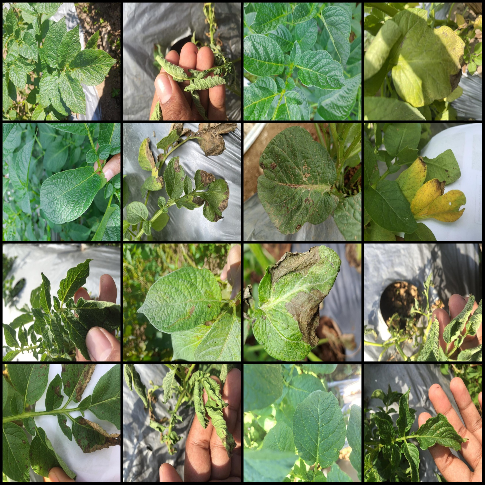
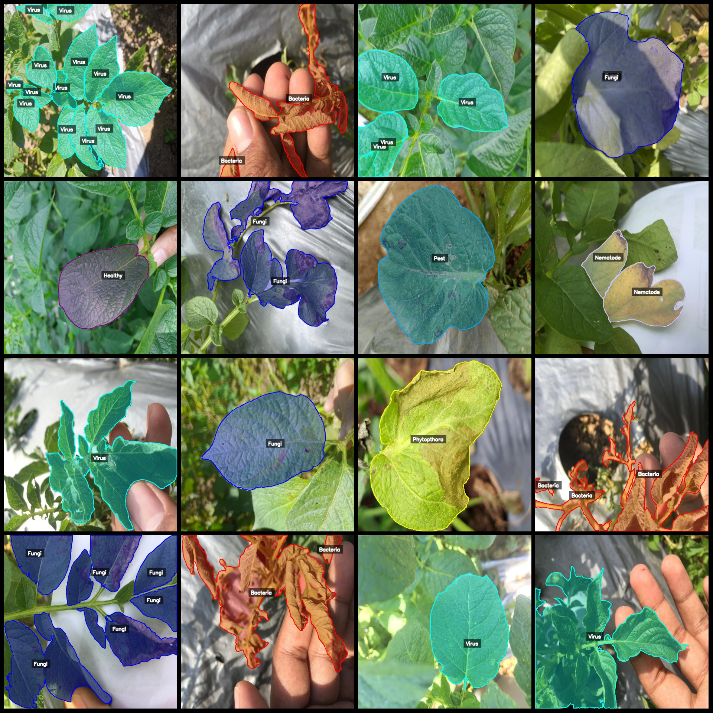
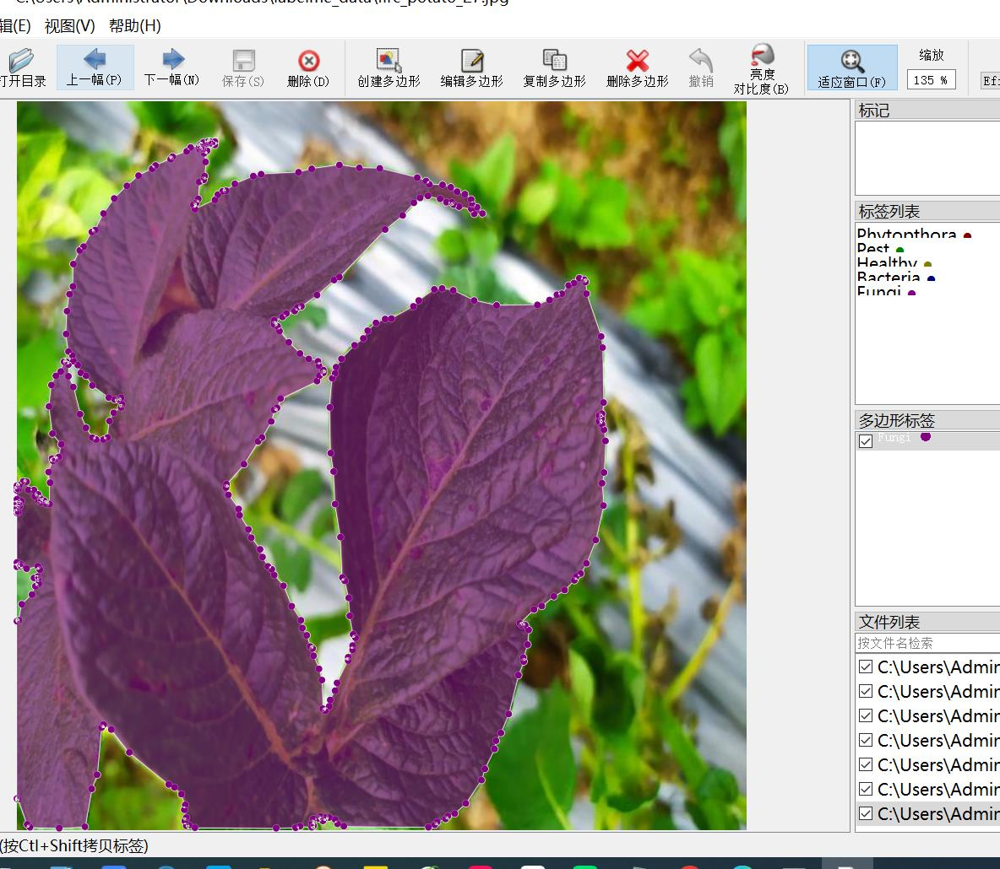

# Intelligent Agriculture Potato Leaves Disease Identification and Segmentation Dataset in LabelMe Format with 3004 Images in 7 Categories

Dataset format: LabelMe format (excluding mask files, only containing JPG images and corresponding JSON files)
Number of images (number of JPG files): 3004
Number of annotations (number of JSON files): 3004
Number of annotation categories: 7
Annotation category names: ["Phytopthora", "Pest", "Virus", "Fungi", "Bacteria", "Healthy", "Nematode"]
Number of boxes for each category:  
Phytopthora (Pandoralinia disease) count = 370  
Pest (Pest) count = 894  
Virus (Virus) count = 1407  
Fungi (Fungus) count = 1167  
Bacteria (Bacterium) count = 1284  
Healthy (Healthy) count = 300  
Nematode (Nematode) count = 129  
Total box count: 5551  
Using labelme tool version: 5.5.0  
Image resolution: 640x640  
Annotation rules: draw polygons for categories  
Important notice: The dataset can be edited using LabelMe, but the JSON dataset needs to be converted into either Yolo or COCO format for instance segmentation or semantic segmentation.
Special declaration: This dataset does not guarantee any accuracy in training models or weights.
Image previews:
Annotation examples:
Original images (randomly selected 16 images):
Annotation drawing results:

## Images

Here is a pay link on Stripe ( https://buy.stripe.com/3cs8yP7sY87d0vu9AB ). Please contact me lonlonago@foxmail.com after funding $89, and I will send you a complete data files , thank you!

